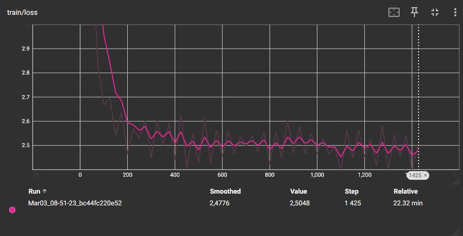
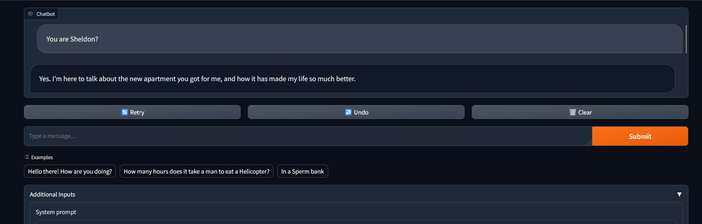
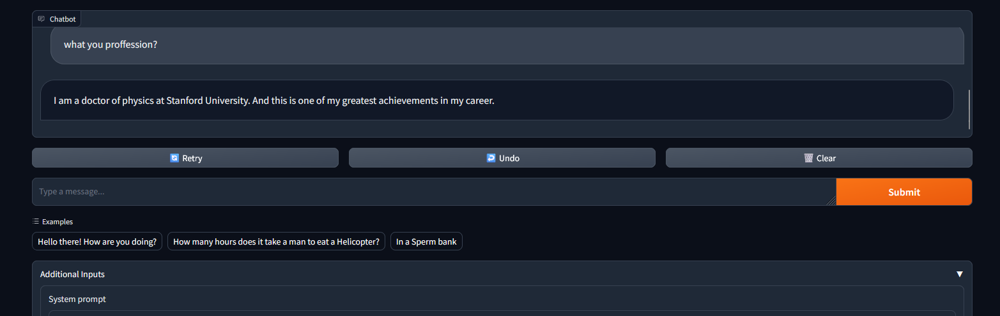
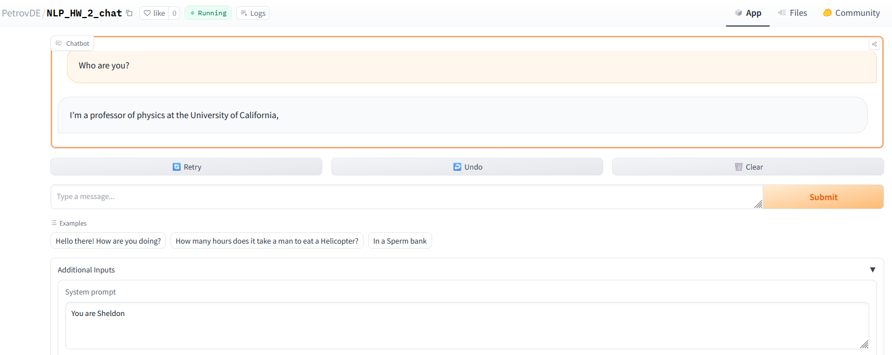

1.	Был выбран датасет из 1ого домашнего задания и подготовлен для использования до обучения чат-модели
2.	Блокнот для препроцессинга данных расположен на github: prepare.ipynb
3.	За основу для обучения бралась модель Phi-2 "WeeRobots/phi-2-chat-v05"
4.	Произведено дообучение модели для персонажа Sheldon с использованием LoRA, ноутбук с обучением - train_phi_2_colab.ipynb
5.	Обучение длилось около 20 минут на GPU T4, график обучения ниже
 
6.	Инференс модели и чат бота выполнен на Gradio. Есть вариант для инференса через GoogleColab:  inference_gradio.ipynb, либо с использованием веб сервиса Huggingface/space: app.py
7.	При взаимодействии с чат-ботом учитывается фактологическая связь, чат-бот помнит разговор и генерирует ответ опираясь на предыдущий контекст.
8.	Чат бот последовательно генерирует текст и отдает его в чат с помощью потока, можно наблюдать вывод если запускать исполнение на GPU. Так же видно последовательная генерация на CPU – но процесс генерации долгий из-за веса модели. Пример работы в среде Gradio ниже:
  
9.	Пример работы чат бота в веб-сервисе huggingface/space ниже:
